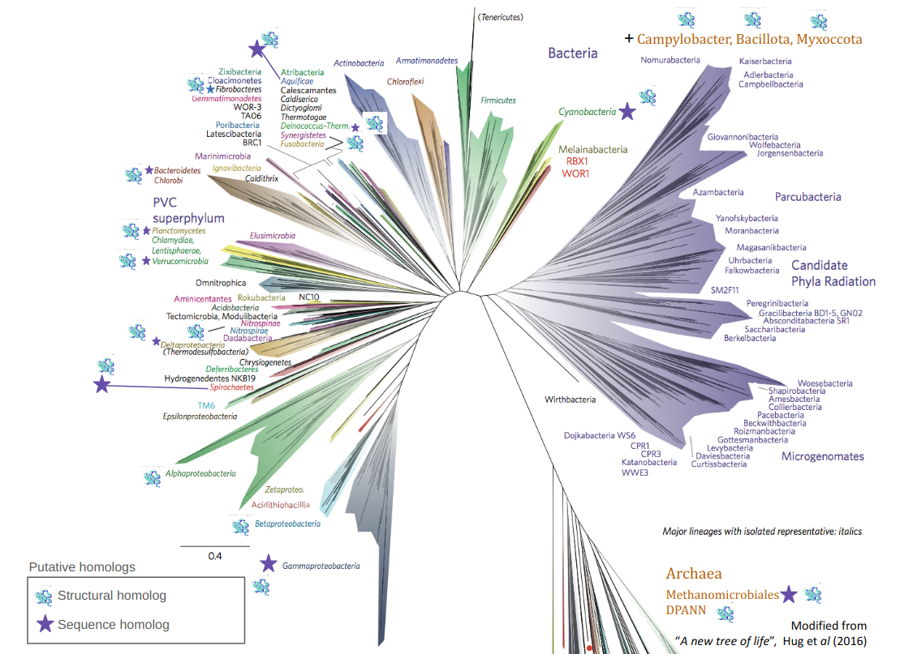

___

THIS PAGE AIMS TO ADD **SUPPLEMENTARY INFORMATION FOR MY POSTULATION FOR CEBEM'S MOBILITY FELOWSHIP (THIRD CALL, 2024)**.

A conceptual approach to the importance of fusogens from an evolutionary approach is given. Later, proposed approaches to perform remote homology searches are further detailed (with some schematic figures), as well as preliminary results regarding the analysis of two families of proteins related to fusogens (fusexins and dynamin-like proteins) are presented.

___

# Membrane fusion: a fundamental process

Life as we know it heavily depends on cellular membranes. The very existence of cells requires the compartmentalization provided by these membranes. The emergence and evolution of different cell types, from the appearance of the first cells (estimated +3000 million years ago) to the present, largely base themselves on the dynamics of interaction and fusion acquired by these cells and the various compartments delimited within them. A variety of key phenomena depend on membrane fusion, such as intra- and extracellular transport (enabling the acquisition and expulsion of nutrients, or cell communication), muscle tissue formation, or the invasion of cells by enveloped viruses. Notably, sex, a defining characteristic of eukaryotes, is fundamentally based on the fusion of gametes.

These events are far from being completely random and spontaneous: proteins called **fusogens** are part of the *ad hoc* cellular machinery that catalyzes these thermodynamically unfavorable fusions. The specificity provided by these cellular fusogens underlies the incessant, and at first glance chaotic, dance of membranes that underpins life.

# Searching for fusogens using computational methods

{width="80%"}

Recent studies from our research group and collaborators have allowed us to predict and experimentally validate a eukaryotic fusogen responsible for the fusion of gametes. We found that this fusogen is homologous to the class II fusogens of enveloped viruses, revealing an ancient exchange between viruses and eukaryotes.

{width="90%"}

This finding has important implications for formulating evolutionary questions regarding the origin of sex, a turning point in the evolution of cellular complexity. Moreover, our results today show that these fusogens exist in Archaea, enriching the landscape. Was sex an invention of archaea, viruses, or eukaryotes? What role do archaeal fusexins play? These are questions that remain unclear to date.

The landscape is even more enigmatic in other cases. For example, sexual fusogens in fungi or vertebrates are unknown. Other cellular fusogens described in the literature also lack a thorough study both in terms of their distribution and their evolutionary dynamics, which is indispensable to understand the evolution of some of the biological processes mentioned earlier.

The appearance of new tools for the inference of structural models such as AlphaFold2 has been revolutionary in this regard, as they allow the detection of remote homologs from the alignment of structural models.

## Proposal for iterative search of fusogens

A comprehensive search of homologues is always needed to be able to delucidate the evolutionary history of any family of protenis. Of course, this is possible only with: i) a diverse database to search against and ii) an efficient algorithm to perform the search.

The following database assembly is proposed in order to get a taxonomically diverse set of eukaryotic structures to search for families of fusogens using structures, illustrated by the following figure

{width="90%"}

An iterative procedure, based on this structural database and the FoldSeek Clusters DB (publicly available) is proposed in order to get the set of homologues in each case (figure bellow)

{width="90%"}

# Advances in the study of fusexins

A collection of fusexin homologs has been collected from previous work. A structural comparison of them clearly shows their structural homology, as shown in the following figure

![Structural comparison of 3D models of archaeal, eukaryotic (HAP2/GCS1) and viral (class II fusexin ectodomains). Structural models were downloaded from PDB or inferred with AlphaFold2 (employing ColabFold).  Flexible alignments were performed with FATCAT and possible structural homology was determined with TM-align (TM-score >= 0.5). Clear structural homology is observed for the Eukarya, Virus and Archaea models, with intradomain clustering showing higher scores. Domains shown in color at the edges of the heatmap.](imgs/matriz_fsxs.png){width="80%"}

But what can we say about the whole superfamily evolution? A first approach, using FoldTree to infer a phylogenetic tree from paired structural distances and rooting the resulting tree using an algorithm named MAD (_minimum ancestor deviation_) shows the following

![Rooted phylogenetic tree inferred with structural data using the Minimum Ancestry Deviation (MAD) algorithm. Paired structural comparison scores (TM-scores) were used to calculate a distance matrix (distance metric: 1-TMscore) for fusexin ectodomains. A phylogeny was inferred by minimum evolution method, which was rooted with the MAD algorithm. The root corresponds to the point where the AD score is minimized (color in the branches). The results do not allow discerning between a viral or a cellular origin for the family.](imgs/arbol_estruct_fsxs.png){width="80%"}

where neither a cellular or viral origin for this fusogen family can be inferred. Further work using better approaches with bigger sets of homologues may help to further ellucidate this evolutionary history, leading to possible clues about how eukaryotic fusexins (and possibly part of eukaryotic sex) evolved.

Interestingly, a classical approach inferring phylogenies with sequence-based methods (restricted to Archaea and Eukarya) shows support for an archaeal origin of eukaryotic sex

![Phylogenetic tree inferred from archaeal and eukaryotic fusexin sequence data. Fusexin ectodomains were aligned and trimmed, and the resulting alignment was recoded following the Hanada scheme, encoding conservative and radical amino acid changes with different characters. Phylogenetic inference was done by maximum likelihood method, using non-reversible models in order to establish polarization for character changes. Root support values are shown for each branch (lower values: blue, higher values: pink). The results suggest an Archaean origin for fusexins. Due to the loss of phylogenetic signal only eukaryotic and archaeal sequences were used.](imgs/arbol_seqs_fsxs.png){width="80%"}

# Advances in the study of dynamin-like proteins 
This interesting family posses members that are known to be mitochondrial fusogens in eukaryotes. Bacterial members have been discovered in the last decades, but their functions remain in many cases unknown (e.g., it has been postulated that might have a role in membrane remodelling, or in fusing lamellar structures in Cyanobacteria).

What is the taxonomic distribution of this family? How diverse are their members in Eukarya and Prokarya? No systematic approach to study their whole evolutionary story has being made to data, probably due to the amount of sequence divergence. A first approach shows the following preliminary results

{width="100%"}

{width="100%"}

Both for eukaryotic and prokaryotic members a vast amount of unknown putative homologs appear to be discovered using either profile-based or structural searches. Further study is needed to ellucidate a complete set of homologues for these family, as well as performing phylogenetic inference in order to delimit a clade for known fusogens (and probable novel fusogens) and study their evolutionary dynamics.

Interstingly, a paired structural comparison between some collected homologs (using structures of known members of the family as seeds for structural searches) shows a clear delimitation of two possible clades

![Paired structural comparison of cluster members from the Foldseek Clusters database. The _bitscore_ value reported by Foldseek for each structural alignment is shown. Structures considered in six clusters involving DLPs with structures already reported in the literature were used for the analysis: bacterial DLPs (from _Nostoc punctiforme_ and _Synechocystis_ sp. PCC 6803), outer membrane mitochondrial fusion mitofusins (yeast Fzo1, vertebrate Mfn1) and inner membrane mitofusins (yeast Mgm1 and vertebrate OPA1). The domain (Eukarya or Archaea) with which each structure is annotated in the UniProt database is also indicated.](imgs/comparacion_struct_dlps.png){width="100%"}

Interestingly, this can lead to at least two hypotheses for the origin of mitochondrial fusogens. Further delucidation of this evolutionary story needs, again, to delimit a final set of homologues and the usage of structural-based phylogenetics, due to the amount of divergence between the members of this intriguing family.

# Relevant works

- [***Arabidopsis* HAP2/GCS1 is a gamete fusion protein homologous to somatic and viral fusogens**](https://www.ncbi.nlm.nih.gov/pmc/articles/PMC5350521/pdf/JCB_201610093.pdf) 
- [The ancient gamete fusogen HAP2 is a eukaryotic class II fusion protein](https://www.cell.com/action/showPdf?pii=S0092-8674%2817%2930109-5)
- [Structure-function studies link class II virus fusogens with the ancestral gamete fusion protein HAP2](https://www.cell.com/action/showPdf?pii=S0960-9822%2817%2930084-2)
- [What came first, the virus or the egg?](https://www.cell.com/cell/pdf/S0092-8674(17)30190-3.pdf)
- [HAP2/GCS1: Mounting evidence of our true biological EVE?](https://journals.plos.org/plosbiology/article/file?id=10.1371/journal.pbio.3000007&type=printable)
- [**Discovery of archaeal fusexins homologous to eukaryotic HAP2/GCS1 gamete fusion proteins**](https://www.nature.com/articles/s41467-022-31564-1)

# _Fusexins_ in the press

- [_A billion years before sex, ancient cells were equipped for it_](https://www.quantamagazine.org/ancient-cells-had-sex-fusion-proteins-long-before-sex-evolved-20220216/). A feature from ***Quanta magazine*** in which...
- [_If you like sex, you might have to thank the archaea_](https://ladiaria.com.uy/ciencia/articulo/2022/7/si-te-gusta-el-sexo-tal-vez-tendrias-que-darles-las-gracias-a-las-arqueas/).
- [_CONICET scientists lead study that sheds light on the origin of sexual reproduction_](https://www.conicet.gov.ar/cientificos-del-conicet-lideran-estudio-que-arroja-luz-sobre-el-origen-de-la-reproduccion-sexual/).
- [_A molecule from ancient bacteria-like cells may shed new light on sexual reproduction_](https://news.ki.se/a-molecule-from-ancient-bacteria-like-cells-may-shed-new-light-on-sexual-reproduction).
- [_Technion researchers and international colleagues hypothesize that the cellular mechanisms enabling the fusion of sperm cells and egg cells originated 3 billion years ago_](https://www.technion.ac.il/en/2022/07/primordial-sexual-reproduction/).
